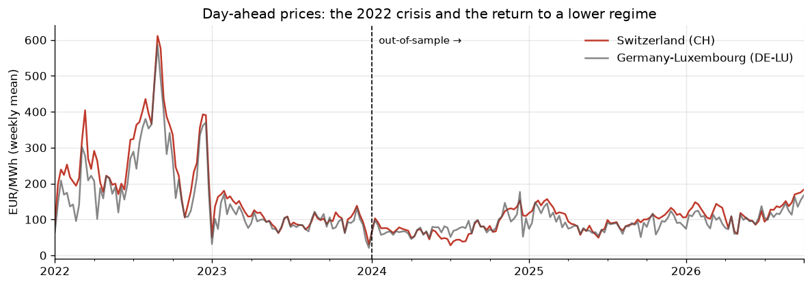
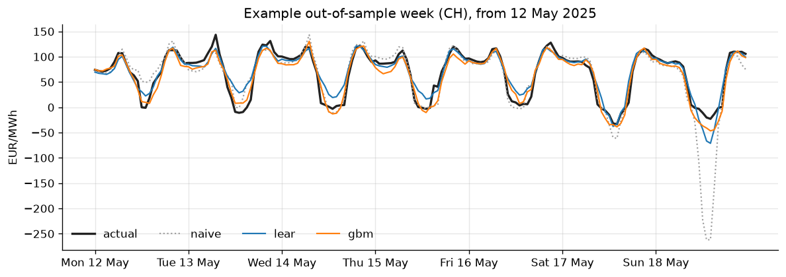
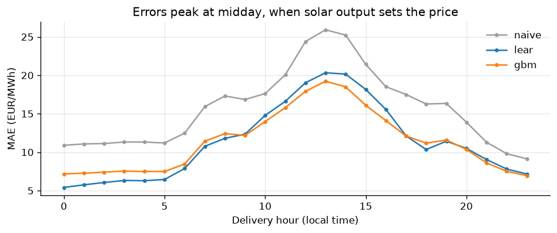
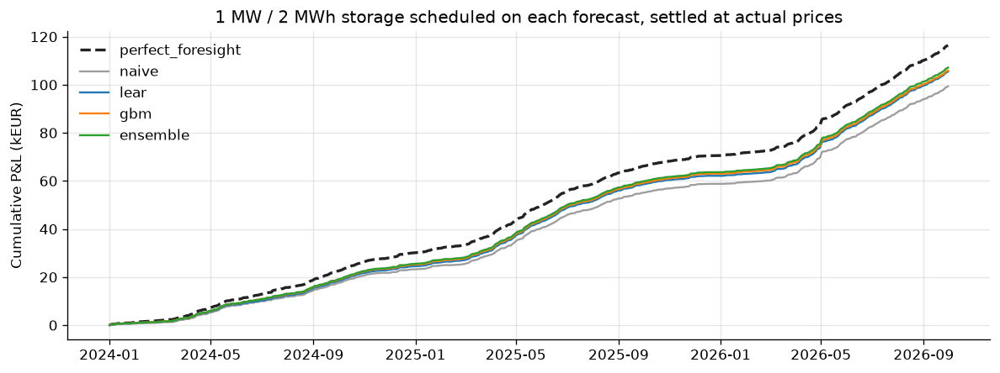
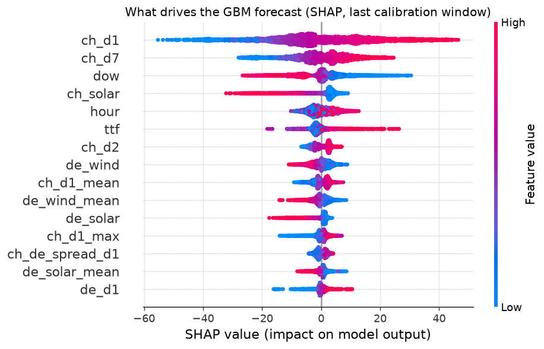

# Swiss day-ahead power price forecasting

Forecasting the hourly Swiss (CH) day-ahead electricity price one day ahead,
and checking whether the forecasts are good enough to *use*: a small storage
asset is scheduled on them and settled at the real prices.

Work in progress — personal project started in October 2026.

## Question

Every day before noon, the next day's 24 hourly Swiss power prices are set in
the day-ahead auction. Anyone who has to bid (a storage operator, a utility, a
trader) needs a forecast of that price curve at around 10:00 the day before.

Two things matter:

1. **Accuracy** — how close is the forecast curve to the realised one?
2. **Value** — does a better MAE actually translate into better decisions?
   A storage asset only cares about *when* the cheap and expensive hours are,
   not about the price level.

## Data

All sources are public and need no API key (`scripts/01_download_data.py`):

| Data | Source | Use |
|---|---|---|
| Day-ahead prices CH and DE-LU, hourly | [Energy-Charts API](https://api.energy-charts.info) (Fraunhofer ISE) | target, lags, German coupling |
| Weather forecasts (temperature, 100 m wind, solar radiation) at 8 points in CH and DE | [Open-Meteo historical forecast API](https://open-meteo.com/en/docs/historical-forecast-api) | renewables and demand drivers |
| TTF gas front-month | Yahoo Finance | marginal cost of gas plants |

Period: January 2022 to September 2026. 2022 is the energy-crisis regime
(weekly average prices above 500 EUR/MWh), which the models have to digest in
their calibration window.



## Method

**Information set.** The forecast for day D is issued on D-1 at 10:00. At that
time the prices of D-1 are known (they were published on D-2), the gas price of
D-2 is the latest settlement, and the weather *forecast* for D is available.
Features are built on a "day × hour" matrix so that every lag is expressed in
whole days. `tests/test_no_lookahead.py` overwrites everything that is not yet
known at issue time and checks that the features of day D do not change.

**Models**

- `naive` — the standard benchmark of the literature: same hour one week ago
  for Monday, Saturday and Sunday, yesterday otherwise.
- `lear` — LASSO-estimated autoregressive model: 24 hour-specific linear
  regressions on lagged prices (D-1, D-2, D-3, D-7), German prices, weather,
  gas and calendar dummies, with an asinh variance-stabilising transform and
  the penalty chosen by AIC (Lago et al., 2021).
- `gbm` — a single LightGBM model on the long (day, hour) table, L1 loss.
- `ensemble` — simple average of `lear` and `gbm`.

**Evaluation.** Walk-forward on 1,004 out-of-sample days (January 2024 to
September 2026). Models are re-estimated every 7 days on a rolling 2-year
window and only ever see data available before the forecast day. No
hyper-parameter was tuned on the test period. Significance of the accuracy
differences is checked with the multivariate Diebold-Mariano test
(Ziel & Weron, 2018).

## Results

### Accuracy (EUR/MWh, out-of-sample)

| Model | MAE | rMAE | RMSE | sMAPE |
|---|---:|---:|---:|---:|
| naive | 15.70 | 1.00 | 26.17 | 27.5 % |
| lear | 11.34 | 0.72 | 18.01 | 20.8 % |
| gbm | 11.36 | 0.72 | 18.74 | 20.6 % |
| **ensemble** | **10.57** | **0.67** | **17.47** | **19.7 %** |

MAE by year: 2024 / 2025 / 2026 = 15.1 / 12.8 / 20.4 (naive) and
10.2 / 8.8 / 13.4 (ensemble).

- LEAR and LightGBM both cut the naive error by about 28 %, and are **not**
  significantly different from each other (DM p = 0.43).
- Their average is significantly better than either of them (DM p < 0.001):
  the linear and the tree model make different mistakes. This is a common
  result in the electricity price forecasting literature.
- 2026 is harder for every model. The average gap between the cheapest and the
  most expensive hour of the day went from 62 EUR/MWh in 2024 to 112 EUR/MWh in
  2026, with deeper solar-driven midday dips, but the gain over the naive
  benchmark stays stable (rMAE 0.67 / 0.69 / 0.66).
- Errors peak at midday: that is when solar output, and so the weather
  forecast, sets the price, including negative prices on sunny weekends.

**Calibration window.** Re-running everything with a 1-year instead of a
2-year rolling window (`python scripts/02_run_forecasts.py --calib-days 365`):

| Ensemble MAE | 2024 | 2025 | 2026 | All |
|---|---:|---:|---:|---:|
| 1-year window | 10.11 | 9.05 | 13.67 | 10.69 |
| 2-year window | 10.16 | 8.82 | 13.43 | 10.57 |

The short window is marginally better only in 2024, when the 2-year window
still contains the 2022 crisis; afterwards the extra year of data wins. The
gap is small, so the conclusions do not depend on this choice.





### Value: scheduling a storage asset

A 1 MW / 2 MWh asset (85 % round-trip efficiency, 5 EUR/MWh wear cost, at most
one cycle per day) is scheduled each day by a mixed-integer linear program on
the forecast prices, then settled at the actual prices. Perfect foresight gives the upper
bound.

| Schedule based on | P&L (EUR) | Share of perfect foresight | Losing days | Max drawdown (EUR) |
|---|---:|---:|---:|---:|
| perfect foresight | 116,438 | 100 % | 0 % | 0 |
| naive | 99,357 | 85.3 % | 9.0 % | -66 |
| lear | 105,472 | 90.6 % | 10.1 % | -74 |
| gbm | 105,972 | 91.0 % | 8.6 % | -65 |
| **ensemble** | **107,149** | **92.0 %** | 8.9 % | -71 |

(1,004 days, 1 MW / 2 MWh. Annualised Sharpe ratios are around 18 for every
strategy and are not very informative here: a storage asset with a daily spread
earns money almost every day.)

The interesting part is the gap between the two tables. The ensemble reduces the
forecast error by 33 %, but only adds 7 points of captured value (85 % → 92 %),
about 7,800 EUR over the period for this asset. The naive forecast already gets
most of the daily *shape* right (night low, solar dip, evening peak), and shape
is all a storage schedule needs. The extra value comes from the days where the
shape changes: weekends, holidays, sudden wind or solar shifts.



### What drives the forecast

SHAP values of the LightGBM model refitted on the last 2 years:

- Yesterday's price at the same hour (`ch_d1`) and last week's (`ch_d7`) carry
  most of the signal: prices are strongly persistent.
- Day of week: weekends are cheaper.
- Swiss solar radiation forecast (`ch_solar`): high radiation pushes the price
  down, by up to about 30 EUR/MWh at midday.
- Gas (`ttf`) sets the level; German wind (`de_wind`) lowers Swiss prices
  through market coupling.



## Limitations

- The Open-Meteo archive stitches the most recent forecast runs, so the
  weather inputs are somewhat more accurate than what was available at 10:00
  on D-1. The weather contribution is therefore probably slightly optimistic.
- No load forecast and no cross-border capacity data yet (both are on the
  ENTSO-E Transparency Platform, which needs an API token).
- The storage backtest is a price-taker on the day-ahead market only: no
  intraday re-optimisation, no balancing market, no bid curves.
- The Swiss pumped-storage and hydro reservoir levels, a major driver of Swiss
  prices in winter, are not modelled.

## Next steps

- [ ] Add ENTSO-E load and wind/solar forecasts as inputs
- [ ] Probabilistic forecasts (quantile regression) and a risk-aware storage schedule
- [ ] Hydro reservoir filling level (SFOE weekly data) as a seasonal feature
- [x] Compare 1-year and 2-year rolling windows
- [ ] Weight recent days more (or combine several windows) around regime changes

## Reproduce

```bash
python -m venv .venv
.venv/Scripts/activate        # Windows (source .venv/bin/activate on Linux/macOS)
pip install -r requirements.txt

python scripts/01_download_data.py      # ~1 min, cached in data/raw
python scripts/02_run_forecasts.py      # walk-forward
python scripts/03_trading_backtest.py   # storage backtest + figures
python scripts/04_explain.py            # SHAP
pytest
```

## Layout

```
src/swisspower/
    config.py      every setting that changes a result
    data.py        download + cache (Energy-Charts, Open-Meteo, Yahoo)
    features.py    day x hour matrices, leak-free features, naive benchmark
    models.py      LEAR and LightGBM
    backtest.py    walk-forward loop
    metrics.py     MAE, rMAE, sMAPE, Diebold-Mariano
    trading.py     storage scheduling (MILP) and P&L metrics
    plots.py
scripts/           the four steps above
tests/             look-ahead test, DST handling, storage LP
reports/           results (csv) and figures
```

## References

- Lago, Marcjasz, De Schutter, Weron (2021). *Forecasting day-ahead electricity
  prices: A review of state-of-the-art algorithms, best practices and an
  open-access benchmark.* Applied Energy 293.
- Uniejewski, Weron, Ziel (2018). *Variance stabilizing transformations for
  electricity spot price forecasting.* IEEE Transactions on Power Systems 33(2).
- Ziel, Weron (2018). *Day-ahead electricity price forecasting with
  high-dimensional structures: Univariate vs. multivariate modeling
  frameworks.* Energy Economics 70.

Data: Energy-Charts / Bundesnetzagentur SMARD (CC BY 4.0), Open-Meteo (CC BY 4.0).
